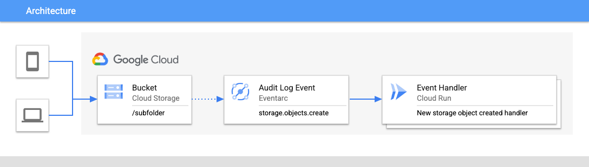

# Cloud Storage subfolder listener example
This example shows how to setup an [Eventarc](https://cloud.google.com/eventarc) listener for a Google Cloud Storage bucket to trigger on object creation in the specific subfolder.



## Setup
### Local Environment settings
Change the EXAMPLE_ID and REGION as you need:
```
export REGION='us-east1'
export EXAMPLE_ID='eda1'

export PROJECT_ID="$(gcloud config get-value project)"
export PROJECT_NUMBER="$(gcloud projects describe $(gcloud config get-value project) --format='value(projectNumber)')"

export SERVICE=$EXAMPLE_ID-$PROJECT_ID-service
export BUCKET_NAME=$EXAMPLE_ID-$PROJECT_ID
export BUCKET=gs://$BUCKET_NAME
export IN_FOLDER=$EXAMPLE_ID-inbound
```
### gcloud CLI
Make sure you have the latest ```gcloud``` SDK and components
```
gcloud components update
```

### Enable GCP APIs
```
gcloud services enable run.googleapis.com cloudbuild.googleapis.com iamcredentials.googleapis.com artifactregistry.googleapis.com

```

### Grant IAM Permissions
```
gcloud projects add-iam-policy-binding $PROJECT_ID --member serviceAccount:$PROJECT_NUMBER-compute@developer.gserviceaccount.com --role roles/eventarc.eventReceiver

gcloud projects add-iam-policy-binding $PROJECT_ID --member serviceAccount:service-$PROJECT_NUMBER@gs-project-accounts.iam.gserviceaccount.com --role roles/pubsub.publisher

gcloud projects add-iam-policy-binding $PROJECT_ID --member serviceAccount:service-$PROJECT_NUMBER@gcp-sa-pubsub.iam.gserviceaccount.com --role roles/iam.serviceAccountTokenCreator
```

### Deploy the code
This will scan the source code in the current directory, build it into a production-ready container image using [Cloud Build](https://cloud.google.com/build) & [Google Cloud's buildpacks](https://cloud.google.com/docs/buildpacks/overview), store the resulting image in the [Artifact Registry](https://cloud.google.com/artifact-registry) and lastly deploy it to [Cloud Run](https://cloud.google.com/run).

Change into the ```event-driven-arch-examples/storage-subfolder``` directory and run the deploy from source command: 

(Note: ```--no-allow-unauthenticated``` flag [blocks unauthenticated invocations](https://cloud.google.com/run/docs/authenticating/public#gcloud) of this new service)

```
gcloud run deploy $SERVICE --region $REGION --no-allow-unauthenticated --source .
```

### Setup the GCS Bucket and folders
Cloud Storage operates with a flat namespace, which means that [folders don't actually exist](https://cloud.google.com/storage/docs/folders#:~:text=in%20Cloud%20Storage.-,Overview,%2Dbucket%2Ffolder1%2Ffile.) within Cloud Storage. If you create an object named folder1/file.txt in the bucket your-bucket, the path to the object is your-bucket/folder1/file.txt, but there is no folder named folder1; instead, the string folder1 is part of the object's name.

```
gsutil mb -l $REGION $BUCKET
```

Create the required folder:
```
touch tmp.txt
gsutil cp -r tmp.txt $BUCKET/${IN_FOLDER}/tmp.txt
```

### Create the Eventarc trigger
Eventarc supports applying a [path pattern](https://cloud.google.com/eventarc/docs/path-patterns) when filtering. The path pattern syntax ```--event-filters-path-pattern``` allows you to define an expression that matches events. This lets you control the granularity of the Eventarc trigger you are creating, and to capture and act on certain events. For example, we can create a trigger that applies to a single event, such as a change to a specific file or folder, or you can extend the scope of the pattern and create a trigger that applies more broadly.
 


Create the trigger:
```
gcloud eventarc triggers create $EXAMPLE_ID-trigger \
 --location=$REGION \
 --destination-run-service=$SERVICE \
 --destination-run-region=$REGION \
 --event-filters="type=google.cloud.audit.log.v1.written" \
 --event-filters="serviceName=storage.googleapis.com" \
 --event-filters="methodName=storage.objects.create" \
 --event-filters-path-pattern="resourceName=/projects/_/buckets/$BUCKET_NAME/objects/$IN_FOLDER/*" \
 --service-account=$PROJECT_NUMBER-compute@developer.gserviceaccount.com
```

### Test the trigger
We will use the gcloud log_streaming component to stream the service logs (this job will run in the background because of ```&``` at the end of our command), you will be prompted to install it if haven't already.
```
gcloud beta run services logs tail $SERVICE --region $REGION --project $PROJECT_ID &
```

Create a file to test with
```
touch $EXAMPLE_ID-test
```

First, let's do a negative test: copy the file into the root of the folder and make sure our code is NOT triggered (no new service logs should be visible in the terminal)
```
gsutil cp ./$EXAMPLE_ID-test $BUCKET/$EXAMPLE_ID-test
```

Now, the REAL test: copy the file into the IN_FOLDER
```
gsutil cp ./$EXAMPLE_ID-test $BUCKET/$IN_FOLDER/$EXAMPLE_ID-test
```

### Clean up
Delete the Eventarc trigger, the Cloud Run service and the Cloud Storage bucket
```
gcloud eventarc triggers delete $EXAMPLE_ID-trigger --location $REGION
gcloud run services delete $SERVICE --region $REGION
gsutil -m rm -r $BUCKET
```


